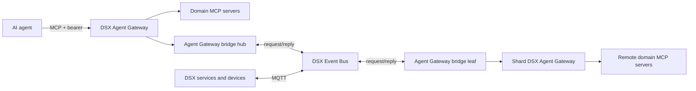

# DSX Exchange

DSX Exchange contains the DSX Event Bus and DSX Agent Gateway, including their
schemas, services, Helm charts, and shared local evaluation environment.

Documentation for DSX Exchange is available at [https://docs.nvidia.com/dsx-exchange](https://docs.nvidia.com/dsx-exchange).

## Overview

The Event Bus provides federated MQTT messaging across DSX control-plane and
data-plane sites. The DSX Agent Gateway provides one authenticated MCP endpoint
for direct and remote domain MCP servers. Its bridge uses the Event Bus to
discover and invoke MCP servers in remote shards.



| Path | Purpose |
|---|---|
| `schemas/` | AsyncAPI contracts for Event Bus MQTT topics and payloads |
| `auth-callout/` | NATS authentication and authorization service |
| `dsx-agentgateway-bridge/` | MCP discovery and request routing across Event Bus sites |
| `deploy/nats-event-bus/` | Event Bus Helm chart |
| `deploy/dsx-agent-gateway/` | DSX Agent Gateway Helm chart |
| `local/` | Shared one-cluster Kind, Skaffold, Zot, CSC, CPC-1, and CPC-2 environment |
| `tests/agent-gateway/` | Agent Gateway functional and performance validation |

The Event Bus is schema agnostic. AsyncAPI schemas document its external
contracts, while NATS and the auth callout enforce routing, federation, and
authorization. The DSX Agent Gateway exposes MCP streamable HTTP at `/mcp`,
validates configured JWT issuers, derives tenant identity with CEL, and denies
unauthorized MCP discovery and invocation by default.

See the [Event Bus deployment guide](deploy/README.md), the
[DSX Agent Gateway chart guide](deploy/dsx-agent-gateway/README.md), and the
[bridge guide](dsx-agentgateway-bridge/README.md) for component configuration.

## Requirements

- OS: Linux or macOS with Docker support.
- Tools: `mise`, `make`, and Docker. Mise installs the remaining tools from the
  locked root toolchain.
- Kubernetes: a local Kind cluster for e2e testing.
- Runtime: Go modules use the Go version pinned in `mise.toml`.

GPU drivers are not required.

## Getting Started

Clone the repository, install the local e2e prerequisites, and run the local
validation checks:

```bash
git clone https://github.com/NVIDIA/dsx-exchange.git
cd dsx-exchange
mise install --locked
make test
```

If you already have a DSX Event Bus and need to build or test an MQTT
integration application, start with the
[Integrator Quickstart](https://docs.nvidia.com/dsx-exchange/integrator-quickstart).

Publish looping dummy BMS data into the local CSC MQTT broker:

```bash
make dummy-bms
```

## Usage

Use the root Makefile for repository-wide workflows:

```bash
make help
make check       # static validation
make test
make local-up
make test-dev
make skaffold-dev
make clean
```

Run focused tests while changing one component:

```bash
make -C auth-callout test
go -C dsx-agentgateway-bridge test ./...
```

After the local Kind environment is deployed, run the dummy BMS demo with
`make dummy-bms`.

The local environment deploys both products from the root source tree. It uses
one Kind node and keeps CSC, CPC-1, and CPC-2 as isolated logical-site
namespaces.

## Performance

`make test` includes smoke-sized Event Bus and Agent Gateway performance
validation suitable for Kind. Run the sustained Agent Gateway benchmark with:

```bash
make perf-benchmark
```

Run the Event Bus benchmark directly:

```bash
go -C local/mqttbs run ./cmd/mqttbs run basic-suite \
  --broker tcp://172.18.200.1:1883
```

See [local/mqttbs/README.md](local/mqttbs/README.md) for smoke-sized options.

## Releases & Roadmap

- Release notes: [CHANGELOG.md](CHANGELOG.md)
- Third-party license inventory: [THIRD_PARTY_LICENSES.csv](THIRD_PARTY_LICENSES.csv) and [THIRD_PARTY_LICENSES.md](THIRD_PARTY_LICENSES.md)

### Versioning

DSX Exchange follows [Semantic Versioning](https://semver.org/) (`vX.Y.Z`), automated via semantic-release. A new version is published automatically when a semantic-release compliant commit is merged to `main`.

| Commit prefix | Version bump | When to use |
|---------------|-------------|-------------|
| `fix:` | Patch (Z) | Bug fixes, CVE remediation |
| `feat:` | Minor (Y) | New features, backward-compatible changes |
| `feat!:` or `BREAKING CHANGE:` | Major (X) | Breaking API, schema, or chart changes |

### Roadmap

Upcoming work is tracked in [GitHub Issues](https://github.com/NVIDIA/dsx-exchange/issues). See [CONTRIBUTING.md](CONTRIBUTING.md) for how to get involved.

## Contribution Guidelines

- Start here: [CONTRIBUTING.md](CONTRIBUTING.md)
- Code of Conduct: [CODE_OF_CONDUCT.md](CODE_OF_CONDUCT.md)

Development quickstart:

```bash
git clone https://github.com/NVIDIA/dsx-exchange.git
cd dsx-exchange
mise install --locked
make test
```

## Governance & Maintainers

- Governance: [GOVERNANCE.md](GOVERNANCE.md)
- Maintainers: [MAINTAINERS.md](MAINTAINERS.md)
- Triage policy: use GitHub issue labels and pull request review from repository maintainers.

## Security

- Vulnerability disclosure: [SECURITY.md](SECURITY.md)
- Do not file public issues for security reports.

## Support

- Support level: Maintained, with best-effort public issue triage.
- Help: file a GitHub issue with a focused reproduction or question.
- Response expectations: no guaranteed service-level agreement.

See [SUPPORT.md](SUPPORT.md) for details.

## Community

Use GitHub issues and pull requests for public project discussion, bug reports, feature requests, and contribution review.

## References

- [NATS](https://nats.io/)
- [NATS auth callout](https://docs.nats.io/running-a-nats-service/configuration/securing_nats/auth_callout)
- [agentgateway](https://agentgateway.dev/)
- [Model Context Protocol](https://modelcontextprotocol.io/)
- [AsyncAPI](https://www.asyncapi.com/)
- [CloudEvents MQTT Protocol Binding](https://github.com/cloudevents/spec/blob/main/cloudevents/bindings/mqtt-protocol-binding.md)

## License

This project is licensed under the Apache License 2.0. See [LICENSE](LICENSE) for details.
