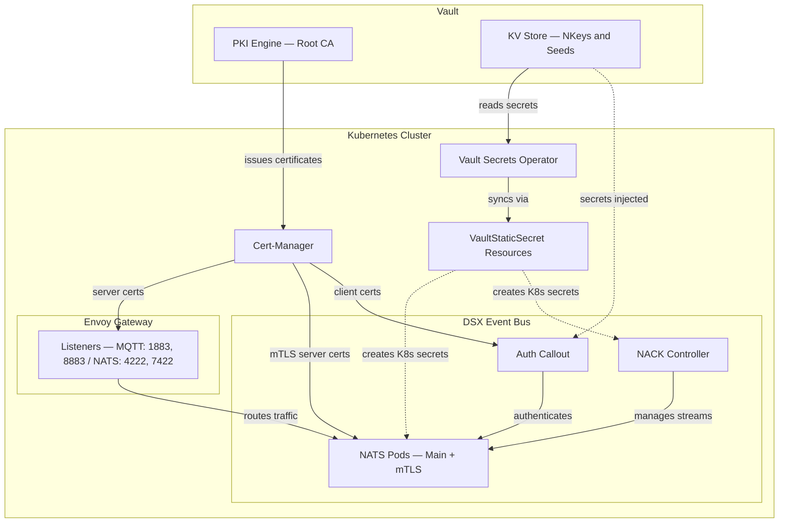

# Pre-Deployment

Everything that must be in place before deploying the DSX Event Bus. This covers infrastructure prerequisites, secrets provisioning, NKey generation, Vault integration, certificate management, and Gateway setup.

## Infrastructure Prerequisites

The following must be installed in each Kubernetes cluster before deploying the event bus:

| Component | Purpose |
|-----------|---------|
| Gateway API controller | e.g., Envoy Gateway (GatewayClass `eg`) for external access |
| MetalLB or cloud LB | LoadBalancer service type for inter-cluster communication |
| cert-manager | TLS certificate lifecycle (server certs, mTLS certs) |
| Prometheus Operator | ServiceMonitor CRD (required by Surveyor) |
| Secrets pipeline | Must materialize Kubernetes Secrets (e.g., Vault + Vault Secrets Operator) |

Keycloak or another OIDC provider is required if using OAuth2 authentication.

## Required Secrets

All secrets must be provisioned before `helm install`. Secret names and keys are overridable in Helm values; these are the defaults.

### NATS Server Auth

| Secret | Keys | Purpose |
|--------|------|---------|
| `nats-auth-signing` | pubkey | AUTH account signing key |
| `nats-xkey` | pubkey | Encryption XKey |

### Auth-Callout Service

| Secret | Keys | Purpose |
|--------|------|---------|
| `nats-authx-user` | pubkey | Auth-callout NATS connection user |
| `auth-callout-keys` | nkey-seed, issuer-seed, xkey-seed | Auth-callout signing and encryption keys |

### NACK Controller

| Secret | Keys | Purpose |
|--------|------|---------|
| `nats-nack-user` | nack-user.nk | NACK NKey file |
|                  | pubkey | NACK user pubkey (for auth-callout permissions) |

### Surveyor

| Secret | Keys | Purpose |
|--------|------|---------|
| `nats-surveyor` | seed, pubkey | Surveyor NKey for SYS account access |

### Cross-Cluster Leaf Connections

Each CPC gets a `nats-leaf-csc` secret. The CSC gets the pubkey for each CPC.

| Secret | Keys | Purpose |
|--------|------|---------|
| `nats-leaf-csc` | seed | CPC-to-CSC leaf connection (CPC only) |
| `nats-leaf-cpc-{id}` | pubkey | CPC leaf users (CSC only, via auth-callout.extraEnvs) |

### mTLS Secrets (when `eventBus.mtls.enabled: true`)

**Server:**

| Secret | Keys | Purpose |
|--------|------|---------|
| `nats-mtls-server-tls` | ca.crt, tls.crt, tls.key | mTLS server certificates |

**Leaf connections:**

| Secret | Keys | Purpose |
|--------|------|---------|
| `nats-mtls-leaf` | seed, pubkey | DC account leaf connection |
| `nats-mtls-authx-leaf` | seed, pubkey | AUTHX account leaf connection |
| `nats-mtls-sys-leaf` | seed, pubkey | SYS account leaf connection (monitoring) |

When `eventBus.mtls.enabled: false`, none of the mTLS secrets are required and the mTLS NATS cluster is not deployed.

## NKey Generation

NKeys are Ed25519 public-key pairs used for NATS authentication. Generate them with `nsc`:

```bash
nsc generate nkey --user     # user nkey (SU seed, U pubkey)
nsc generate nkey --account  # account nkey (SA seed, A pubkey)
nsc generate nkey --curve    # xkey (SX seed, X pubkey)
```

### Required Keys

| Key | Type | Required |
|-----|------|----------|
| auth-signing | account nkey | Always |
| authx-user | user nkey | Always |
| nack-user | user nkey | Always |
| surveyor | user nkey | Always |
| xkey | xkey | Always |
| authx-leaf-user | user nkey | When mTLS enabled |
| mtls-leaf-user | user nkey | When mTLS enabled |
| mtls-sys-leaf-user | user nkey | When mTLS enabled |

### Generation Script

A script generates all required secrets for a cluster:

```bash
./deploy/scripts/generate-nkeys.sh [OPTIONS] [cpc-ids...]

# Options:
#   -c, --cluster CLUSTER    Cluster name: csc or cpc-{id} (default: csc)
#   -o, --output DIR         Output directory (default: ./secrets/{cluster})

# Examples:
./deploy/scripts/generate-nkeys.sh -c csc 1 2 3    # CSC with CPC IDs 1, 2, 3
./deploy/scripts/generate-nkeys.sh -c cpc-1          # CPC-1
```

Output structure:

```text
secrets/{cluster}/
  nkeys/
    nats-auth-signing/
    nats-xkey/
    nats-authx-user/
    nats-nack-user/
    nats-mtls-leaf/
    nats-mtls-authx-leaf/
    nats-mtls-sys-leaf/
    nats-surveyor/
    auth-callout-keys/
    nats-leaf-cpc-{id}/     # CSC only
    xkey.nk
```

## Vault Integration (Reference Example)

The interface for secrets is Kubernetes Secrets — any pipeline that materializes them works. The reference deployment uses Vault:

- **KV Secret Engine** — stores NKeys and seeds
- **PKI Secret Engine** — Root CA and certificate issuance
- **Vault Secrets Operator** — materializes Vault KV secrets into Kubernetes secrets
- **Vault Agent Injector** — injects secrets directly into the auth-callout pod



### VaultStaticSecret Example

```yaml
apiVersion: secrets.hashicorp.com/v1beta1
kind: VaultStaticSecret
metadata:
  name: nack-user
spec:
  type: kv-v2
  vaultAuthRef: vault-secrets-operator-system/vault-auth
  mount: kv/components
  path: event-bus/nack-user
  destination:
    name: nack-user
    create: true
    type: "Opaque"
```

## Certificate Management

cert-manager with a Vault Issuer handles TLS certificate lifecycle. Vault's PKI engine issues certificates signed by the event bus Root CA.

### Server TLS Certificate

All TLS-terminated Gateway listeners reference a cert-manager Certificate:

```yaml
apiVersion: cert-manager.io/v1
kind: Certificate
metadata:
  name: event-bus-server-tls-certificate
spec:
  secretName: event-bus-server-tls-certificate
  issuerRef:
    name: event-bus-certificate-issuer
    kind: Issuer
  commonName: "event-bus.example.com"
  dnsNames:
    - "event-bus.example.com"
```

## Gateway Setup

A Gateway controller (Envoy Gateway) must be installed before deploying the event bus. The Gateway resource defines the external listeners that route traffic to the NATS pods.

### Gateway Resource

```yaml
apiVersion: gateway.networking.k8s.io/v1
kind: Gateway
metadata:
  name: event-bus-gateway
spec:
  gatewayClassName: eg
  listeners:
    - name: mqtt
      protocol: TLS
      port: 1883
      allowedRoutes:
        namespaces:
          from: All
      tls:
        mode: Terminate
        certificateRefs:
          - kind: Secret
            name: event-bus-server-tls-certificate
    - name: nats-client
      protocol: TLS
      port: 4222
      allowedRoutes:
        namespaces:
          from: All
      tls:
        mode: Terminate
        certificateRefs:
          - kind: Secret
            name: event-bus-server-tls-certificate
    - name: nats-leafnode
      protocol: TLS
      port: 7422
      allowedRoutes:
        namespaces:
          from: All
      tls:
        mode: Terminate
        certificateRefs:
          - kind: Secret
            name: event-bus-server-tls-certificate
    - name: mqtt-mtls
      protocol: TLS
      port: 8883
      allowedRoutes:
        namespaces:
          from: All
      tls:
        mode: Passthrough
  infrastructure:
    parametersRef:
      group: gateway.envoyproxy.io
      kind: EnvoyProxy
      name: event-bus-proxy-config
```

The `mqtt-mtls` listener uses Passthrough mode because TLS termination happens at the NATS pod to verify the client certificate.

### Listener-to-Route Mapping

Gateway listener names must match the `sectionName` in the Helm `gateway.routes` values. Route kind depends on the TLS mode:

| Listener | Port | TLS Mode | Route Kind |
|----------|------|----------|------------|
| mqtt | 1883 | Terminate | TCPRoute |
| nats-client | 4222 | Terminate | TCPRoute |
| nats-leafnode | 7422 | Terminate | TCPRoute |
| mqtt-mtls | 8883 | Passthrough | TLSRoute |
