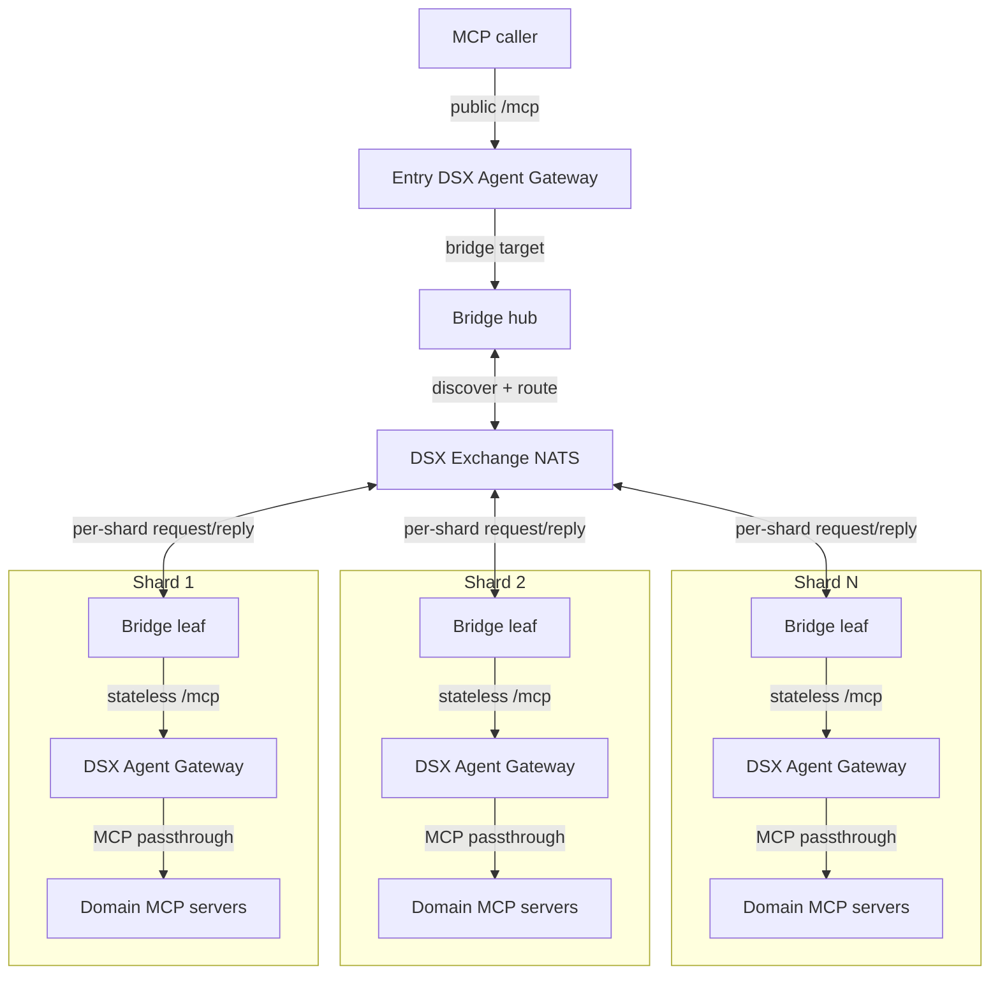
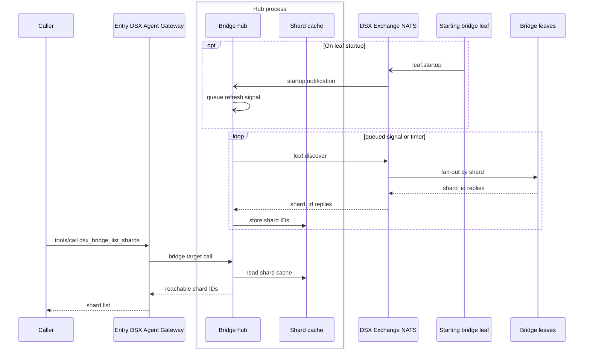
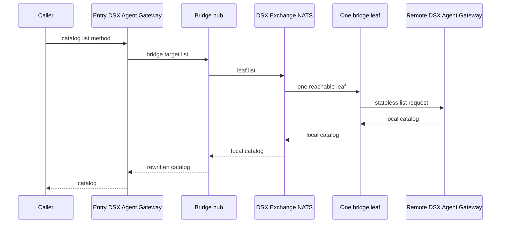
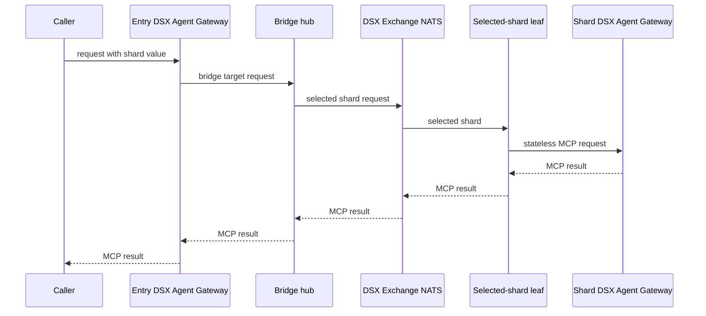
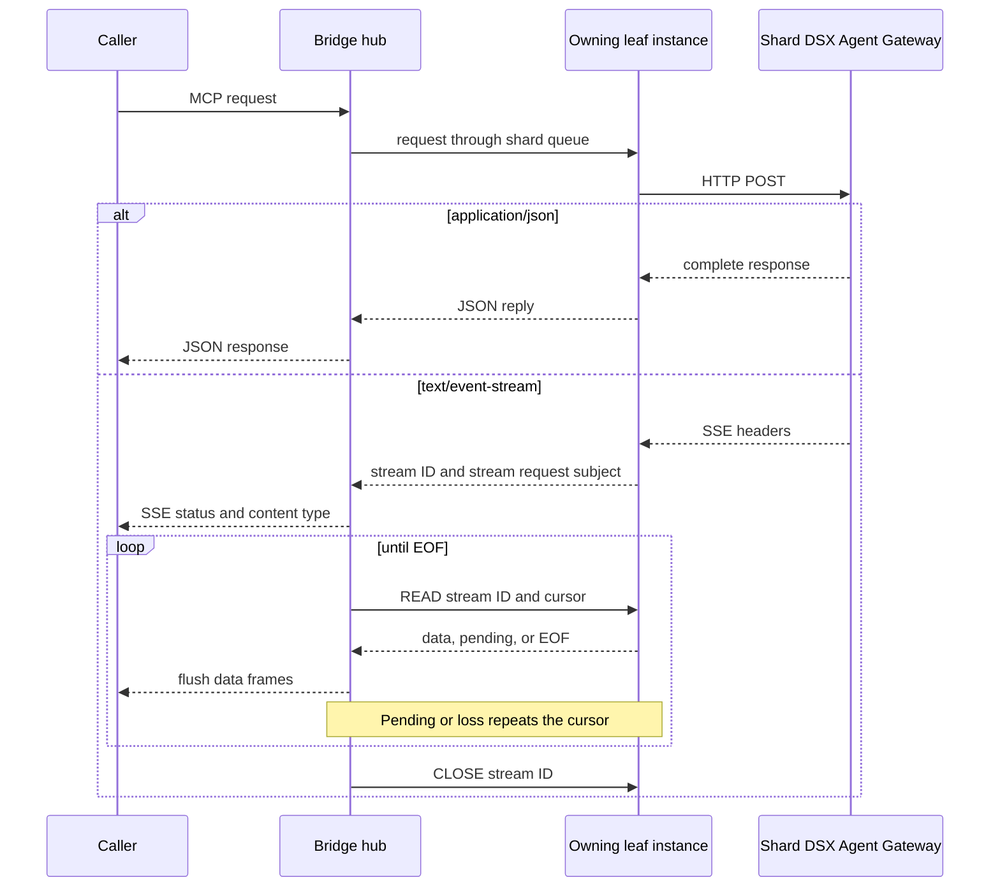

# DSX Agent Gateway Bridge

One entry DSX Agent Gateway exposes remote shard catalogs through the bridge.
Bridge processes keep no MCP session state.

The hub is a target behind the entry gateway. Leaves sit in front of shard
gateways. Hub and leaf bridge processes use DSX Exchange NATS for request-reply.

Bridge-only checks use `cd dsx-agentgateway-bridge && mise exec -- go test ./...`.
Broader dataplane validation is documented at the repo root.

## Topology

## Request Routing Modes

### Mode 1: Shard Discovery

Callers use `dsx_bridge_list_shards` before choosing a shard. The bridge adds
that tool to `tools/list`. The hub serves it from a shard cache.

A background loop refreshes on timer or queued `leaf.startup` notifications.
The hub also performs a synchronous refresh during startup.

### Mode 2: Catalog List

Applies to `tools/list` and `prompts/list` when the request reaches the bridge
target.

The hub sends `leaf.list` on NATS. All leaves join one global list queue group,
so NATS selects one reachable leaf. That leaf lists its local gateway. The hub
rewrites that one catalog. It does not enumerate discovered shards. The hub
injects a required `shard_id` parameter into tool and prompt entries.
`resources/list` and `resources/templates/list` are not supported by the
stateless bridge.

Example for a list response from shard `cpc-1`:

| Leaf entry | Bridge list entry |
|---|---|
| tool `remote-tool` | tool `remote-tool` with required `shard_id` input |
| prompt `prompt-a` | prompt `prompt-a` with required `shard_id` argument |

Resource paths are unsupported at the bridge boundary. The bridge does not
synthesize shard-prefixed resource URIs or URI templates.

### Mode 3: Routed Invocation

Applies to `tools/call`, `prompts/get`, and prompt `completion/complete` when
the request reaches the bridge target.

Tool calls, prompt calls, and prompt completions carry `shard_id`. The hub
removes the shard value, chooses the shard subject, and forwards the request.
Leaves open a stateless `/mcp` request to their local shard gateways. They
forward caller headers without MCP session IDs. `resources/read` and
resource-reference completion are not supported by the stateless bridge.

#### Streaming Responses

Every routed call starts as an ordinary request on the shard queue. JSON returns
in that request's single reply. For SSE, the reply instead identifies the stream
and its stream request subject, which the hub long-polls for data.

Each `READ` result is its NATS reply. The leaf keeps one frame until the cursor
advances, so repeating a cursor recovers a dropped Core NATS request or reply
without duplicating caller output. `CLOSE`, cancellation, and idle expiry
release the upstream response. An initial invocation is sent once so an
ambiguous missing reply cannot replay side-effecting work.

## Bridge Contract

`initialize` and `ping` are handled by the hub and return JSON-RPC responses.
JSON-RPC notifications, including `notifications/initialized`, list-change
notifications, and task-status notifications, return HTTP 202 with no body.
Methods that need MCP session state, client state, or resource path routing in
the bridge return an unsupported JSON-RPC error. Routed shard invocations
preserve the leaf DSX Agent Gateway's streamable HTTP response. JSON responses
return as one ordinary JSON-RPC response. An SSE response identifies its leaf
instance in the initial reply. The hub then uses ordinary request-reply reads
against that instance. Each read returns data, a pending marker, or EOF. Reads
that lose a request or reply repeat the same stream cursor.

With the bridge runtime default, NATS subjects use the
`dsx.agentgateway.bridge.v1` prefix:

| Subject suffix | Queue group | Purpose |
|---|---|---|
| `leaf.discover` | one group per `SHARD_ID` | Hub shard discovery with one reply per shard ID. |
| `leaf.list` | one global list group | Catalog list request served by one reachable leaf. |
| `leaf.<SHARD_ID>.mcp` | one group per `SHARD_ID` | Routed JSON and SSE invocation served by one replica of the selected shard. |
| `leaf.<SHARD_ID>.mcp.<INSTANCE_ID>` | none | SSE READ and CLOSE requests served by the leaf instance that owns the stream. |
| `leaf.startup` | none | Leaf startup notification. Hubs subscribe and refresh shard discovery. |

## Configuration

The Helm chart renders the same image with either `hub` or `leaf` as the
container argument. Install it through the
[chart deployment guide](../deploy/dsx-agent-gateway/README.md).

| Chart value | Purpose |
|---|---|
| `bridge.enabled` | Deploy the bridge. |
| `bridge.role` | Run the bridge as `hub` or `leaf`. |
| `bridge.replicaCount` | Set the number of bridge Pods. |
| `runtimeClassName` | Select the RuntimeClass for gateway, rate-limit, and bridge Pods. |
| `bridge.resources` | Set bridge container requests and limits. |
| `bridge.nodeSelector` | Select nodes for bridge Pods. |
| `bridge.tolerations` | Set bridge Pod tolerations. |
| `bridge.shardId` | Set the leaf shard ID. It must not contain `.`, `*`, `>`, null, or whitespace. |
| `bridge.nats.endpoint` | Select the in-cluster NATS Service with `serviceName`, `namespace`, and `port`. |
| `bridge.nats.auth.mode` | Select `noauth` or `oauth`. |
| `bridge.nats.auth.oauth.issuer` | Set the OAuth issuer with `scheme`, `serviceName`, `namespace`, and `port`. |
| `bridge.nats.auth.oauth.scope` | Set the OAuth token scope. |
| `bridge.nats.auth.oauth.clientCredentialsSecretRef` | Name the Secret containing the client ID and secret. Optional `clientIDKey` and `clientSecretKey` fields override the default keys. |
| `bridge.nats.tls.enabled` | Enable NATS client TLS. |
| `bridge.nats.tls.serverName` | Set the expected NATS server name. |
| `bridge.nats.tls.caSecretRef` | Name the Secret and key containing the NATS CA certificate. |
| `bridge.http.requestTimeout` | Set the maximum lifetime of a hub HTTP request. |
| `bridge.http.writeTimeout` | Set the maximum time a hub response write may block. |

For release `<release>` in namespace `<namespace>`, both roles use Deployment
`<release>-bridge`. Only the hub creates Service `<release>-bridge` on port
3001 and, when metrics are enabled, port 9464. A leaf uses
`http://<release>.<namespace>.svc:80/mcp` as its local gateway
origin.

### Runtime mapping

| Runtime setting | Source |
|---|---|
| `NATS_URL` | Synthesized from `bridge.nats.endpoint`. |
| `SUBJECT_PREFIX` | Bridge runtime default. |
| `REQUEST_TIMEOUT` | Bridge runtime default. |
| `HTTP_REQUEST_TIMEOUT` | `bridge.http.requestTimeout` in hub mode. |
| `HTTP_WRITE_TIMEOUT` | `bridge.http.writeTimeout` in hub mode. |
| `SHARD_ID` | `bridge.shardId` in leaf mode. |
| `LOCAL_GATEWAY_ORIGIN` | Release-derived in leaf mode. |
| `NATS_AUTH_MODE` | `bridge.nats.auth.mode`. |
| `NATS_OAUTH_ISSUER` | Synthesized from `bridge.nats.auth.oauth.issuer`. |
| `NATS_OAUTH_CLIENT_ID_FILE` and `NATS_OAUTH_CLIENT_SECRET_FILE` | Files mounted from `bridge.nats.auth.oauth.clientCredentialsSecretRef`. |
| `NATS_OAUTH_SCOPE` | `bridge.nats.auth.oauth.scope`. |
| `NATS_TLS_ENABLED`, `NATS_TLS_SERVER_NAME`, and `NATS_TLS_CA_FILE` | `bridge.nats.tls`. |

The `oauth` mode uses the DSX Exchange auth-callout NATS token path. The bridge
discovers the issuer's token endpoint, obtains an OAuth2 access token with
client credentials, then connects to NATS with the access token in the NATS
token field. The OAuth2 token source caches valid tokens and rereads file-backed
client credentials when it has to fetch a new token. Issuer and scope are direct
config values. The chart mounts one Secret containing client ID and client
secret. The `noauth` mode sends no credentials. TLS settings are independent of
the auth mode.

## Health And Observability

- Hub listens on port `3001` for MCP, `/readyz`, and `/livez`.
- Leaf listens on port `3001` for `/readyz` and `/livez`.
- OpenTelemetry autoexport serves enabled metrics on port `9464`.
- Hub readiness requires NATS connectivity and a completed shard-discovery
cache. Leaf readiness requires NATS connectivity.
- Both roles emit JSON logs and export enabled traces over OTLP/gRPC.

Metrics and tracing deployment settings are documented together in the
[chart deployment guide](../deploy/dsx-agent-gateway/README.md).
