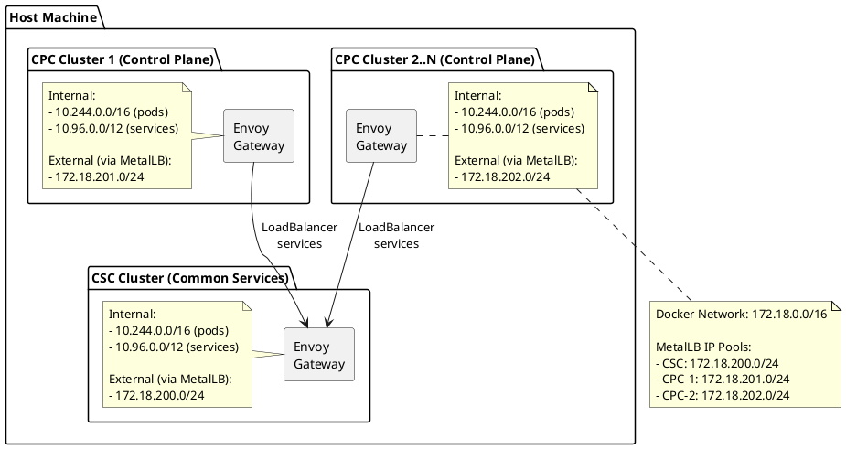

# Infrastructure Setup

This directory contains the infrastructure configuration for the DSX Event Bus evaluation environment.

## Overview

The infrastructure consists of:

- Kind clusters (CSC + CPC 1..N)
- MetalLB for LoadBalancer services
- Envoy Gateway controllers
- Metrics Server for resource metrics (CPU/memory)
- Keycloak for OAuth2 authentication (development)
- Prometheus for ServiceMonitor-backed metrics

## Quick Start

On macOS, install and start `docker-mac-net-connect` before running local tests
from the host. Linux hosts normally reach the Docker bridge IPs directly. See
[local/README.md](../README.md#macos-tweaks).

From the repository root:

```bash
make -C local test
```

## Local Targets

The repository root `skaffold.yaml` imports `local/infra/skaffold.yaml` and
`local/nats/skaffold.yaml`. Host scripts handle prerequisites, Kind cluster
creation, local registry setup, and NATS secret preparation. Skaffold deploys
the infra chart releases with Helm and applies local cluster config manifests.

- `skaffold-run`: complete local stack, including infrastructure and NATS.
- `skaffold-dev`: complete local stack with file watching.

## Cluster Details

### CSC - Common Services Cluster

**Network:**

- Pod subnet: 10.244.0.0/16 (overlaps with CPC clusters)
- Service subnet: 10.96.0.0/12 (overlaps with CPC clusters)
- **Note**: Internal addresses overlap intentionally - clusters communicate only via Envoy Gateway LoadBalancer services

**Nodes:**

- 1 control-plane
- 3 workers (labeled with topology zones)

### CPC - Control Plane Cluster (1..N)

**Network:**

- Pod subnet: 10.244.0.0/16 (overlaps with CSC and other CPC clusters)
- Service subnet: 10.96.0.0/12 (overlaps with CSC and other CPC clusters)
- **Note**: Internal addresses overlap intentionally - clusters communicate only via Envoy Gateway LoadBalancer services

**Nodes:**

- 1 control-plane
- 3 workers (labeled with topology zones)

## MetalLB Setup

MetalLB provides LoadBalancer service type support in Kind clusters.

**Why MetalLB?**
Since clusters have overlapping internal networks, they cannot directly route to each other. MetalLB provides unique external IPs from the Docker network that enable inter-cluster communication through Envoy Gateway.

**Gateway IPs (on Docker network 172.18.0.0/16):**

- CSC: 172.18.200.1
- CPC-1: 172.18.201.1
- CPC-2: 172.18.202.1

These IPs are **separate and non-overlapping**, allowing clusters to reach each other's Envoy Gateway services via the Docker network.

**Configuration:**

```yaml
apiVersion: metallb.io/v1beta1
kind: IPAddressPool
metadata:
  name: csc-pool
  namespace: metallb-system
spec:
  addresses:
    - 172.18.200.1/32
---
apiVersion: metallb.io/v1beta1
kind: L2Advertisement
metadata:
  name: csc-l2-advert
  namespace: metallb-system
spec:
  ipAddressPools:
    - csc-pool
  interfaces:
    - eth0
```

## Envoy Gateway Setup

Envoy Gateway provides modern, high-performance HTTP/HTTPS ingress and API gateway capabilities.

**Usage:**

The shared Gateway (`shared-gateway`) is deployed in the `envoy-gateway-system` namespace and provides TCP listeners for NATS (ports 1883, 4222, 7422), a TLS passthrough listener for mTLS MQTT (port 8883), and an HTTP listener (port 80) for Keycloak.

Example HTTPRoute for Keycloak:

```yaml
apiVersion: gateway.networking.k8s.io/v1
kind: HTTPRoute
metadata:
  name: keycloak
  namespace: keycloak
spec:
  parentRefs:
    - name: shared-gateway
      namespace: envoy-gateway-system
  rules:
    - matches:
        - path:
            type: PathPrefix
            value: /
      backendRefs:
        - name: keycloak-service
          port: 8080
```

## cert-manager

cert-manager provides automatic certificate management for TLS certificates. It's deployed to all clusters for future TLS support.

## Metrics Server

Kubernetes Metrics Server provides resource metrics (CPU/memory) for nodes and pods, enabling `kubectl top` commands and Horizontal Pod Autoscaling (HPA).

**Note:** Uses the official metrics-server Helm chart with
`--kubelet-insecure-tls` for Kind compatibility.

**Usage:**

```bash
# View node metrics
kubectl top nodes --context kind-csc

# View pod metrics
kubectl top pods -n event-bus --context kind-csc
```

## Keycloak (OAuth2 Authentication)

Keycloak provides OAuth2/OpenID Connect authentication for testing the event bus auth callout service. A single Keycloak instance runs in the CSC cluster, and all clusters (CSC, CPC-1, CPC-2) access it via the external MetalLB LoadBalancer IP (172.18.200.1). Host-side local tests use the same Envoy Gateway path.

**Configuration:**

- **Realm**: `event-bus` (auto-imported at startup via ConfigMap `keycloak-realm-import`)
- **Grant Type**: Client Credentials (machine-to-machine authentication)
- **Scope**: `mqtt` (required for MQTT access)
- **Clients** (service accounts with client credentials enabled, shared across all clusters):
  - `mqtt-client` / `mqtt-client-secret` (full access to test topics)
  - `mqtt-publisher` / `mqtt-publisher-secret` (publish only)
  - `mqtt-subscriber` / `mqtt-subscriber-secret` (subscribe only)

**Access:**

Keycloak is exposed via Envoy Gateway HTTPRoute on port 80 at the CSC cluster's MetalLB LoadBalancer IP: `172.18.200.1`. On macOS, keep `docker-mac-net-connect` running so the host can reach this address. Linux hosts normally reach the Docker bridge IPs directly.

```bash
# Verify Keycloak from the host
curl http://172.18.200.1/realms/event-bus/.well-known/openid-configuration
```

**Token Endpoint (all clusters):**

- `http://172.18.200.1/realms/event-bus/protocol/openid-connect/token`

**JWKS Endpoint (used by auth-callout in all clusters):**

- `http://172.18.200.1/realms/event-bus/protocol/openid-connect/certs`

**Access Keycloak Admin Console:**

```bash
# Open http://172.18.200.1/admin/master/console/
# Admin credentials: admin/admin
```

**Testing:**

```bash
# Obtain a token using client credentials grant
curl -X POST "http://172.18.200.1/realms/event-bus/protocol/openid-connect/token" \
  -H 'Content-Type: application/x-www-form-urlencoded' \
  -d 'grant_type=client_credentials' \
  -d 'client_id=mqtt-client' \
  -d 'client_secret=mqtt-client-secret' \
  -d 'scope=mqtt'
```

**Architecture:**

- Single Keycloak instance in CSC cluster
- All clusters access via external IP (172.18.200.1)
- Simplified configuration with shared OAuth2 clients
- Consistent authentication across all clusters

**Note:** This is a minimal development setup using:

- H2 in-memory database (no persistence)
- HTTP only (no TLS)
- Single replica
- Not suitable for production

## Prometheus

The local stack installs a lightweight kube-prometheus-stack in each cluster.

**Components:**

- Prometheus Operator
- Prometheus Server

**Access Prometheus:**

```bash
# Port-forward to Prometheus
kubectl port-forward -n monitoring svc/prometheus-kube-prometheus-prometheus 9090:9090 --context kind-csc

# Open http://localhost:9090
```

## Network Architecture



**Key Design Points:**

1. **Overlapping Internal Networks**: All clusters use the same internal address space (10.244.0.0/16 for pods, 10.96.0.0/12 for services). This is intentional and mirrors real-world separate clusters.

2. **Gateway-Only Communication**: Clusters are completely isolated. All inter-cluster communication flows through Envoy Gateway LoadBalancer services with unique external IPs.

3. **Network Isolation**: Each cluster is a separate Kind cluster on the same Docker network but with isolated internal networking. They cannot directly route to each other's pod or service IPs.

4. **External Access**: Services are accessed via MetalLB LoadBalancer IPs on the Docker network (CSC: 172.18.200.0/24, CPC-1: 172.18.201.0/24, CPC-2: 172.18.202.0/24, etc.).

5. **Federation Model**: Event bus federation happens via:
   - CPC -> CSC: MQTT bridge through Envoy Gateway LoadBalancer

## Topology Awareness

Worker nodes are labeled with topology zones for anti-affinity:

- `topology.kubernetes.io/zone=zone-a`
- `topology.kubernetes.io/zone=zone-b`
- `topology.kubernetes.io/zone=zone-c`

**Usage in Deployments:**

```yaml
spec:
  affinity:
    podAntiAffinity:
      requiredDuringSchedulingIgnoredDuringExecution:
      - labelSelector:
          matchExpressions:
          - key: app
            operator: In
            values:
            - nats
        topologyKey: topology.kubernetes.io/zone
```

This ensures high availability by spreading pods across different zones.

## Resource Requirements

**Minimum:**

- CPU: 4 cores
- Memory: 8 GB
- Disk: 20 GB

**Recommended:**

- CPU: 8 cores
- Memory: 16 GB
- Disk: 50 GB

**Per Cluster:**

- Control plane: ~1 CPU, ~2 GB RAM
- Each worker: ~500m CPU, ~1 GB RAM

## Troubleshooting

### Cluster Creation Fails

```bash
# Check Docker resources
docker system info

# Increase Docker Desktop resources:
# Settings -> Resources -> Advanced
# - CPUs: 4+
# - Memory: 8GB+

# Clean up and retry
make -C local clean
make -C local setup-clusters
```

### MetalLB Not Working

```bash
# Check MetalLB pods
kubectl get pods -n metallb-system --context kind-csc

# Check logs
kubectl logs -n metallb-system -l app=metallb --context kind-csc

# Verify IP pools
kubectl get ipaddresspools -n metallb-system --context kind-csc
```

### Envoy Gateway Not Working

```bash
# Check Envoy Gateway controller
kubectl get pods -n envoy-gateway-system --context kind-csc

# Check Gateway resources
kubectl get gateway -A --context kind-csc
kubectl get httproute -A --context kind-csc

# Check Gateway status
kubectl describe gateway shared-gateway -n envoy-gateway-system --context kind-csc

# Get LoadBalancer IP from Gateway resource
GATEWAY_IP=$(kubectl get gateway shared-gateway -n envoy-gateway-system --context kind-csc -o jsonpath='{.status.addresses[0].value}')
echo "Gateway IP: $GATEWAY_IP"

# Test gateway HTTP listener
curl http://${GATEWAY_IP}/
```

### Keycloak Not Working

```bash
# Check Keycloak pods
kubectl get pods -n keycloak --context kind-csc

# Check logs
kubectl logs -n keycloak -l app.kubernetes.io/name=keycloak --context kind-csc

# Check realm import ConfigMap. The import key is realm-event-bus.json and the
# Keycloak realm inside that file is event-bus.
kubectl get configmap keycloak-realm-import -n keycloak --context kind-csc -o yaml

# Test token endpoint via external IP using client credentials
curl -X POST "http://172.18.200.1/realms/event-bus/protocol/openid-connect/token" \
  -H 'Content-Type: application/x-www-form-urlencoded' \
  -d 'grant_type=client_credentials' \
  -d 'client_id=mqtt-client' \
  -d 'client_secret=mqtt-client-secret' \
  -d 'scope=mqtt'
```

### Prometheus Not Scraping

```bash
# Check ServiceMonitor resources
kubectl get servicemonitor -A --context kind-csc

# Check Prometheus targets
# Access Prometheus UI and check Status -> Targets

# Verify service labels match ServiceMonitor selector
kubectl get svc -n event-bus -o yaml --context kind-csc
```

## Cleanup

```bash
# Delete all clusters
make -C local clean

# Or delete individually
kind delete cluster --name csc
kind delete cluster --name cpc-1
kind delete cluster --name cpc-2
```

## Next Steps

After the local stack is ready:

1. Reconcile the local stack after config or image changes:

   ```bash
   make -C local skaffold-run
   ```

2. Run tests:

   ```bash
   make -C local test
   ```

3. Inspect Prometheus targets:

   ```bash
   kubectl port-forward -n monitoring svc/prometheus-kube-prometheus-prometheus 9090:9090 --context kind-csc
   ```
