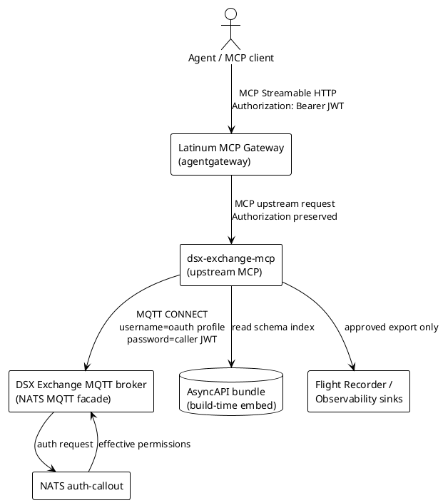
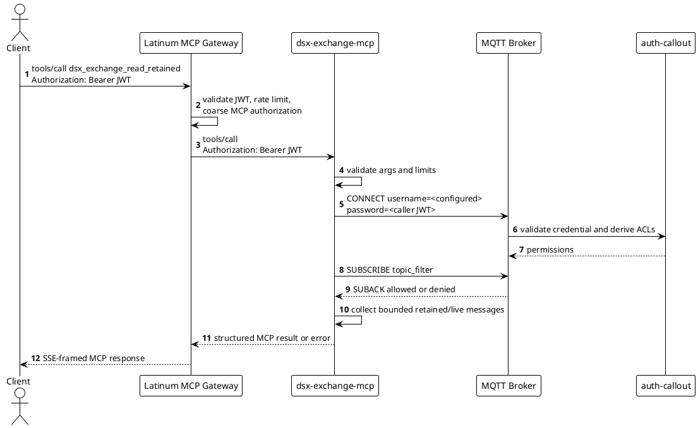
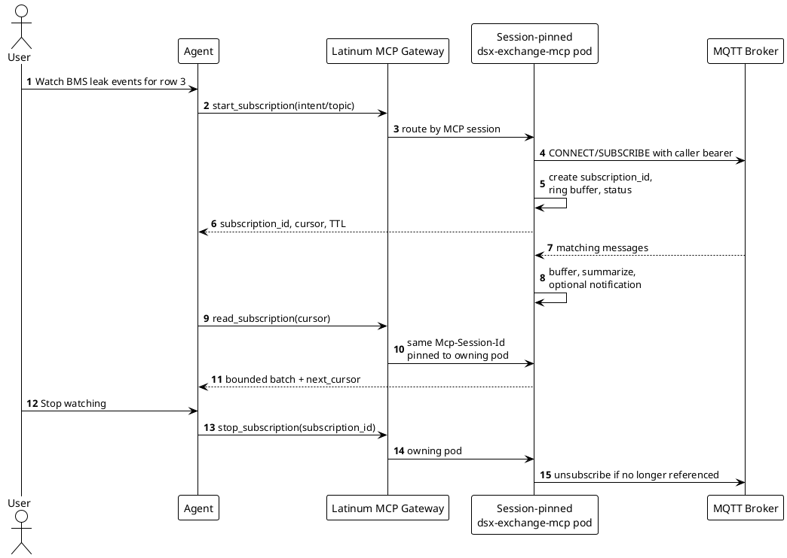

# DSX Exchange MCP

## Aggregated Requirements

This section is intentionally placed before the normal SDD template sections so
reviewers can see the DSX Exchange MCP requirements in one place before reading
the design.

### MCP Requirements From DSX Exchange PRD

The DSX Exchange PRD defines MCP as a first-class Exchange interface. The PRD
contains duplicate entries for `MCP-13` and `MCP-14`; this SDD treats each
requirement once.

| ID | Priority | Aggregated Requirement |
| :--- | :---: | :--- |
| MCP-1 | P0 | Provide one MCP endpoint where agents discover every tool they are authorized to use across topology, power, health, events, and logs. |
| MCP-2 | P0 | Expose MCP-compliant tool schemas with clear input types and response structures. |
| MCP-3 | P0 | Scope tool discovery to caller permissions so unauthorized tools do not appear. |
| MCP-4 | P0 | Support infrastructure topology queries for nodes, switches, racks, and physical relationships. |
| MCP-5 | P0 | Include cooling-to-compute relationships in topology results. |
| MCP-6 | P0 | Support pre-flight queries for power headroom, cooling capacity, and available compute before provisioning. |
| MCP-7 | P0 | Use the same real-time power telemetry source as MaxLPS / DSX LPS. |
| MCP-8 | P1 | Support resource health, availability, and utilization queries across compute, cooling, and power. |
| MCP-9 | P1 | Surface correlated anomalies such as CDU flow drops co-located with GPU temperature rise. |
| MCP-10 | P1 | Let agents subscribe to curated Exchange event topics through MCP tools, pre-filtered by domain and relevance. |
| MCP-11 | P1 | Surface BMS leak events with operational context such as rack ID, affected compute, and recommended action. |
| MCP-12 | P2 | Retrieve operational logs and correlated event context through one MCP workflow. |
| MCP-13 | P1 | Support asynchronous tasks with status, TTL, and persistence for long-running operations. |
| MCP-14 | P1 | Show long-running agent tasks in audit logs with status and initiating identity. |
| MCP-15 | P0 | Require NVIDIA-approved authentication and token validation before any MCP tool invocation. |
| MCP-16 | P0 | Validate that tokens were issued for the intended protected resource. |
| MCP-17 | P0 | Retrieve credentials from a centralized secret store and avoid local client-secret storage. |
| MCP-18 | P0 | Audit every MCP tool invocation with caller identity, timestamp, tool name, and input parameters. |
| MCP-19 | P1 | Return structured, actionable MCP errors. |
| MCP-20 | P1 | Support pagination or cursoring for large result sets. |
| MCP-21 | P1 | Provide mock or stub mode for the MCP Gateway and all Exchange tools. |
| MCP-22 | P1 | Use the same factory data model across Exchange events, APIs, and MCP tools. |
| MCP-23 | P1 | Provide a documented pattern and reference implementation for partner-built agents. |
| MCP-24 | P0 | Treat MCP as a first-class Exchange interface with reliability, auth, observability, and documentation equivalent to the MQTT layer. |
| MCP-25 | P0 | Resolve and document the relationship between read-only MCP Gateway and action-taking CLI/TUI MCP surfaces. |

### Long-Running Subscription UX Requirements

The long-running subscription UX note adds the following requirements for
background Exchange watches.

| ID | Priority | Aggregated Requirement |
| :--- | :---: | :--- |
| LSUB-1 | P0 | Start a long-running Exchange subscription and return a `subscription_id` immediately. |
| LSUB-2 | P0 | Allow users to ask an agent to watch a topic or domain without knowing raw MQTT hierarchy. |
| LSUB-3 | P0 | Read buffered messages by cursor with bounded `max_messages` and `max_bytes`. |
| LSUB-4 | P0 | Summarize what happened since a watch started. |
| LSUB-5 | P0 | Report subscription status such as running, reconnecting, expired, denied, or buffer overflow. |
| LSUB-6 | P1 | Emit optional MCP / SSE notifications when messages arrive or status changes. |
| LSUB-7 | P1 | Compute aggregations over a background stream such as counts, latest values, min/max/avg, or grouping by topic/object type. |
| LSUB-8 | P1 | Dump bounded raw message batches as JSON or JSONL for debugging. |
| LSUB-9 | P1 | Export a subscription to approved observability sinks such as Flight Recorder or logs. |
| LSUB-10 | P0 | Audit every subscription start, read, aggregation, export, and stop with caller identity and arguments. |
| LSUB-11 | P0 | Stop subscriptions explicitly and expire idle or over-TTL subscriptions automatically. |
| LSUB-12 | P1 | Return structured errors for ACL denial, authentication failure, reconnect exhaustion, buffer overflow, and expired subscriptions. |

### DSX Exchange PRD Requirements Applied To MCP

The PRD frames Exchange as a shared communication layer for compute, network,
power, cooling, IT, OT, and agents. For the MCP interface this means:

| Area | Applied MCP Requirement |
| :--- | :--- |
| Exchange Foundation | MCP must expose Exchange as one coherent integration surface, not as separate one-off integrations per system. Events, MCP tools, and APIs must share the same auth model, data model, governance, versioning, and deprecation posture. |
| MQTT Machine Integration | MCP tools must let agents observe BMS, DPS / power-management, grid, NICO, SPIFFE, and other Exchange domains through schema-derived topics without requiring raw MQTT client code. |
| Multi-Site Needs | MCP must preserve Exchange layer isolation and controlled federation. Agents must not use MCP to bypass MDC/VDC/VMS boundaries or site/hall/shard policy. |
| Identity and Security | Every MCP read, watch, export, and future action must be authenticated, authorized by tenant/project/caller identity, scoped in discovery, rate limited, revocable, and audited. |
| Partner Integration | MCP must expose partner-consumable contracts based on AsyncAPI schemas, with staging/mock paths for agent and integration development. |
| Operational Needs | MCP must expose health, readiness, Prometheus metrics, structured JSON logs, and actionable degradation signals for critical Exchange paths. |
| Sovereign Needs | MCP must support air-gapped operation with no runtime dependency on external documentation or schema fetches. |

### Requirements Inherited From Latinum MCP Server SRD

| Area | Applied Requirement |
| :--- | :--- |
| Protocol | Implement MCP Streamable HTTP for discovery, invocation, response handling, resources, tools, and server-to-client notifications where supported. |
| Discovery Consistency | A caller must not see tools or resources they are not authorized to invoke or read. Discovery must not be a leak channel. |
| Backend Authorization | The gateway performs coarse authorization and forwards the caller credential unchanged. The upstream server remains responsible for fine-grained authorization. |
| Async Operations | Support asynchronous patterns for long-running operations. For Exchange MCP, this primarily means background watches with status, TTL, audit, and bounded reads. |
| Performance | Keep discovery fast, bound tool execution, support at least 100 concurrent agent connections, and fit within per-tenant gateway rate limits. |
| Reliability | Provide liveness/readiness probes, graceful degradation when Exchange is unavailable, and HA deployment with pod anti-affinity. |
| Security | Use NVIDIA-approved auth, TLS at deployment boundaries, input validation, egress control, centralized secret management for server credentials, no local credential storage, and audit logging. |
| Operability | Deploy as Kubernetes-native workload, emit JSON logs and Prometheus-compatible metrics, support configuration by environment / ConfigMap, and support zero-downtime rolling upgrades where active in-memory watches permit it. |
| Testability | Provide automated tests, performance validation, and mock/stub mode for agent development. |

### Requirements Inherited From Latinum MCP Gateway SDD

| Area | Applied Requirement |
| :--- | :--- |
| Gateway Topology | `dsx-exchange-mcp` is an upstream MCP server behind the Latinum MCP Gateway, not a separate external endpoint for agents in production. |
| Bearer Passthrough | The gateway validates the caller JWT and forwards `Authorization: Bearer <jwt>` unchanged to the upstream. |
| Coarse + Fine Auth | Gateway CEL policy filters MCP items coarsely. `dsx-exchange-mcp` and the Exchange broker enforce fine-grained resource and topic authorization. |
| Stateful Sessions | Agentgateway stateful MCP session routing uses `Mcp-Session-Id` to keep follow-up requests pinned to the resolved upstream pod. |
| Selector Targets | Production upstream registration must use selector-based targets so session routing can pin to individual backend pods. |
| Aggregation Prefixes | In multi-upstream gateway deployments, tools are exposed with gateway target prefixes. The SDD must describe bare upstream names and gateway-prefixed names where relevant. |
| Failure Semantics | MCP-layer denials return JSON-RPC errors in SSE frames; auth/rate-limit/malformed requests may return HTTP errors before reaching the upstream. |
| Audit Correlation | Gateway and upstream logs correlate through timestamp, caller identity, and MCP session ID. |

### Requirements Inherited From Latinum Event Bus SRD / SDD

| Area | Applied Requirement |
| :--- | :--- |
| Protocol | DSX Exchange uses MQTT 3.1.1 as the client-facing protocol on NATS. |
| Auth | OAuth2 / SSA JWTs may be supplied in the MQTT password field. Auth methods on one connection are mutually exclusive. |
| Authorization | Publish and subscribe permissions are enforced by predefined topic/subject patterns with dynamic wildcard matching. |
| Source Of Truth | Broker/auth-callout enforcement is authoritative for MQTT access. MCP must not duplicate policy in a divergent way. |
| Federation | MCP must respect Exchange federation, topic prefixing, and layer isolation. It observes the topic space visible to the caller's broker account. |
| Persistence | Retained messages and QoS state are broker/JetStream concerns. MCP does not become a durable event database. |
| Schemas | The bus is schema agnostic, but DSX Exchange participants publish formal AsyncAPI specs for every exposed subject and payload. |
| Observability | Exchange components must emit stdout logs, Prometheus metrics, and health endpoints. |
| Performance | MCP must protect the broker from unbounded agent reads through caps, cursors, probe limits, and per-pod concurrency limits. |

# Software Architecture & Design Document (PLC-L1 SADD v2018-02-07/NGC)

## Revision History

| Version | Date | Modified By | Description |
| :---: | :---: | :--- | :--- |
| 0.1 | May 18, 2026 | Codex | Initial DSX Exchange MCP SDD draft from PRD, SRD/SDD inputs, handoff notes, and long-running subscription UX. |

## Stakeholder Approvals

| Stakeholder Name | Role | Date | Approver Comments |
| :--- | :---: | :---: | :--- |
| TBD | pic |  |  |
| TBD | prod |  |  |
| TBD | arch |  |  |
| TBD | eng |  |  |
| TBD | qa |  |  |
| TBD | sec |  |  |

# 1 Introduction

## 1.1 Overview

`dsx-exchange-mcp` is the DSX Exchange upstream MCP server for agents. It sits
behind the Latinum MCP Gateway and exposes Exchange schemas, topic discovery,
bounded reads, retained metadata reads, and long-running background watches over
DSX Exchange MQTT topics.

The production north-star is:

```text
Agent / MCP client
  -> Latinum MCP Gateway /mcp
  -> dsx-exchange-mcp upstream MCP server
  -> DSX Exchange MQTT broker
  -> NATS auth-callout and broker ACL enforcement
```

The MCP interface does not replace DSX Exchange as the system-to-system event
bus. It gives agents a safe, discoverable, audited way to observe Exchange data
and reason over factory state. Read-oriented MCP functionality is in scope for
this SDD. Action-taking CLI/TUI MCP integration is identified by the PRD as a
required architectural decision, but direct write tools are not introduced here
until each action surface has explicit topic, setpoint, authorization, and audit
constraints.

This SDD distinguishes three Exchange MCP data paths:

1. **Schema and topic discovery.** Agents read AsyncAPI-derived resources and
   call helper tools that map user intent to authorized Exchange topics.
2. **Bounded reads.** Agents read retained metadata or collect live messages
   for bounded windows with message, duration, and byte caps.
3. **Background watches.** Agents start long-running MQTT subscriptions that
   continue in the background, buffer bounded data under a `subscription_id`,
   and are consumed through cursor reads, summaries, aggregations, optional
   notifications, and explicit stop/expiry.

## 1.2 Assumptions, Constraints, Dependencies

### Assumptions

* Production callers use the Latinum MCP Gateway. Direct access to
  `dsx-exchange-mcp` is for development and diagnostics.
* The gateway validates caller JWTs, applies coarse MCP item authorization, and
  forwards the original bearer to upstream MCP servers.
* DSX Exchange broker/auth-callout remains authoritative for MQTT
  authentication and topic ACLs.
* AsyncAPI specs are the canonical machine-readable Exchange schema source for
  MCP topic discovery and helper tools.
* v1 background watches use pod-local, in-memory state owned by the
  session-pinned `dsx-exchange-mcp` pod and are lost on pod restart or session
  loss.
* v1 intentionally optimizes for a simple, bounded background-watch UX before
  adding external durable watch infrastructure. Strict stateless compliance for
  watches requires externalizing watch metadata, cursors, and buffers.

### Constraints

* MCP discovery must not expose tools, resources, schema domains, or channels
  the caller is not authorized to use.
* The MCP server must not hold broad service credentials for user data access.
* The MCP server must not become a durable event database or unrestricted data
  export path.
* Raw MQTT topic filters supplied by agents must be validated and bounded.
* Long-running watches must have TTL, idle expiry, buffer limits, and explicit
  overflow policy.
* Streamable HTTP / SSE notifications are optional acceleration signals; they
  are not the only reliable data consumption mechanism.

### Dependencies

| Dependency | Purpose |
| :--- | :--- |
| Latinum MCP Gateway | External MCP endpoint, caller authentication, coarse discovery filtering, rate limiting, bearer passthrough, stateful session routing. |
| DSX Exchange MQTT broker | MQTT 3.1.1 topic subscription, retained messages, broker-level ACL enforcement. |
| NATS auth-callout | Validates MQTT credentials and mints effective NATS permissions used by the broker. |
| DSX Exchange schema repository | AsyncAPI specs for BMS, power-management, NICO, SPIFFE exchange, and future domains. |
| Flight Recorder / observability stack | Approved export and incident-evidence destination for selected background watches. |
| Central secret store | Source of broker CA material or service-side credentials that are not caller credentials. |
| External watch state store, future | Valkey, Redis, JetStream, or another approved backend for durable watch metadata, cursors, and buffers when v1 pod-local state is insufficient. |

## 1.3 Definitions, Acronyms, Abbreviations

| Term | Definition |
| :--- | :--- |
| MCP | Model Context Protocol. JSON-RPC 2.0 over Streamable HTTP for agent tools, resources, prompts, and notifications. |
| Exchange | DSX Exchange, the AI factory shared communication layer over the Latinum Event Bus. |
| MQTT | MQTT 3.1.1, the DSX Exchange client-facing pub/sub protocol. |
| AsyncAPI | Schema format used by DSX Exchange to define MQTT topics, operations, messages, and payloads. |
| BMS | Building Management System. Publishes physical plant telemetry and metadata. |
| NICO | Managed host / bare-metal state system publishing lifecycle events. |
| SPIFFE | Secure Production Identity Framework For Everyone. Used for workload identity and key distribution. |
| ACL | Access control list. In this design, broker subscribe/publish permissions derived by auth-callout. |
| Background watch | A long-running MQTT subscription created through MCP, identified by `subscription_id`, buffered server-side, and read through bounded calls. |
| Cursor | Monotonic subscription buffer position used to read bounded batches without re-sending all messages. |
| Logical subscription | One MCP-created background watch with its own `subscription_id`, topic filter, cursor, buffer, status, TTL, and audit state. |
| MQTT client | One broker connection authenticated with one effective caller authorization context. A pod may run many MQTT clients. |
| SSE | Server-Sent Events, used by MCP Streamable HTTP for server-to-client response frames and optional notifications. |

## 1.4 Reference Documents

| Document | Location |
| :--- | :--- |
| DSX Exchange PRD | `docs/input/[WIP] DSX Exchange PRD.docx` |
| Latinum Event Bus SRD | `../latinum-event-bus-poc/docs/Latinum Event Bus SRD.md` |
| Latinum Event Bus SDD | `../latinum-event-bus-poc/docs/Latinum Event Bus SDD.md` |
| Latinum MCP Server SRD | `../dsx-mcp/Latinum MCP Server - SRD.md` |
| Latinum MCP Gateway SDD | `../dsx-mcp/Latinum MCP Gateway - SDD.md` |
| DSX MCP / Exchange MCP Handoff | `../DSX_MCP_HANDOFF.md` |
| DSX Exchange MCP Discussion Notes | `docs/sdd-discussion-notes.md` |
| Long-Running Subscription UX | `docs/long-running-subscriptions-ux.md` |
| DSX Exchange Schema README | `../schema/README.md` |
| AsyncAPI specs | `../schema/specs/*.yaml` |

# 2 Architecture Details

## 2.1 System Context

`dsx-exchange-mcp` is an upstream MCP server. It is not exposed directly to
agents in the production profile. Agents authenticate to the Latinum MCP Gateway
and receive an aggregated tool/resource catalogue filtered by gateway policy.
When an Exchange tool is invoked, the gateway forwards the caller bearer to
`dsx-exchange-mcp`. The upstream server uses that bearer when connecting to the
Exchange MQTT broker.



## 2.2 Request Flow For Bounded Reads



The upstream server does not decide whether a caller is allowed to subscribe to
a topic by trusting claims alone. It asks the broker through the actual MQTT
connect/subscribe path, or through a future entitlement API backed by the same
permission manager.

## 2.3 JWT Passthrough To MQTT

The caller bearer follows this path:

```text
Client Authorization header
  -> Latinum MCP Gateway validation
  -> gateway upstream Authorization passthrough
  -> dsx-exchange-mcp request context
  -> MQTT CONNECT password
  -> NATS auth-callout validation and permission derivation
```

The MQTT username is deployment configuration. The bearer is never accepted as
an MCP tool argument and is never logged. `dsx-exchange-mcp` logs only whether a
bearer was present plus normalized caller identity fields supplied by the
gateway or derived from the validated context.

This design keeps one authority for MQTT topic access. The gateway can hide or
block MCP items coarsely, but broker SUBACK denial remains the final control for
actual topic subscription.

## 2.4 AsyncAPI Schema Access And Tool Generation

The server embeds AsyncAPI specs at build time. At startup it parses each
non-empty domain spec into a schema access index:

| Index Field | Purpose |
| :--- | :--- |
| Domain | `bms`, `power-management`, `nico`, `spiffe-exchange`, and future domains. |
| Channel name | Stable AsyncAPI channel key. |
| MQTT address | Raw channel address, including parameters such as `{pointType}` or `{tagPath}`. |
| MQTT filter examples | Agent-safe filters derived from parameters, enums, and documented examples. |
| NATS subject pattern | MQTT-to-NATS conversion used for entitlement intersection. |
| Operation direction | Whether the channel is for publish, subscribe, or both from a consumer viewpoint. |
| Message schema | Payload schema reference and content type. |
| Domain hints | Operational labels such as metadata, value, leak, power, keyset, state transition. |

The index supports four MCP behaviors:

1. Resource reads for authorized schema domains.
2. Topic-finding tools that map user intent to schema-derived filters.
3. Curated domain tools for BMS metadata, topology graph extraction, power
   events, NICO state transitions, and SPIFFE public keysets.
4. Authorization-aware hiding of domains/channels the caller cannot subscribe
   to.

The initial domain interpretation is:

| Domain | MCP Treatment |
| :--- | :--- |
| BMS | Parse Value / Metadata channel pairs. Prefer retained metadata reads before live value subscriptions. Build relationships from metadata fields such as object IDs, process area, served load IDs, rack/CDU/power/cooling relationships, and integration ownership. |
| Power Management | Parse CloudEvents channels for grid load target, power state status, breach alert, and enforcement outcomes. Provide topic discovery and event summaries; write actions are out of scope until control constraints are approved. |
| NICO | Parse managed host state topics and expose state transition watches, counts, and machine-scoped filters. |
| SPIFFE Exchange | Parse public keyset topics and expose read-only discovery of tenant/kid key distribution where authorized. |

## 2.5 Schema Visibility And ACLs

Schema visibility must match effective subscribe authorization. A caller should
not see a domain or channel that is not relevant to any topic they can read.

### Tactical V1: Canonical Broker Probes

When no entitlement API is available, the server can perform bounded MQTT
authorization probes using the caller bearer:

```text
MQTT CONNECT with caller bearer
MQTT SUBSCRIBE canonical schema filter
observe SUBACK success or denial
cache decision briefly, no longer than token expiry
```

Example canonical probes:

| Domain | Probe Filter |
| :--- | :--- |
| BMS metadata | `BMS/v1/PUB/Metadata/#` |
| BMS values | `BMS/v1/PUB/Value/#` |
| Power management | schema-derived grid/power-management subscribe prefixes |
| NICO | `nico/v1/machine/+/state` or deployment-approved equivalent |
| SPIFFE Exchange | `spiffe-exchange/v1/pub-keysets/tenant/+/kid/+` or tenant-scoped equivalent |

Probe limits are mandatory: short connect and subscribe timeouts, low probe
counts per discovery request, fail-closed on ambiguous broker/network errors,
and metrics for probe latency and failures.

The limitation is false negatives for narrow ACLs. If a caller can read only a
specific rack path, a broad domain probe may fail even though a subset of the
schema applies. That limitation is why canonical probes are tactical, not the
preferred production design.

### Preferred Production: Entitlement API

The preferred design is a read-only entitlement API backed by the same
permission manager used by auth-callout. It exposes the effective subscribe
decision or effective permissions without becoming a second source of truth.
The broker still enforces actual MQTT access.

The entitlement API can support:

```http
POST /v1/authorize
{
  "token": "<caller jwt>",
  "action": "mqtt.subscribe",
  "topic_filter": "BMS/v1/PUB/Metadata/#"
}
```

or:

```http
POST /v1/effective-permissions
{
  "token": "<caller jwt>",
  "protocol": "mqtt"
}
```

`dsx-exchange-mcp` maps effective MQTT/NATS permissions to schema capabilities
by intersecting ACL patterns with the AsyncAPI access index. Deny rules take
precedence. If a partial allow/deny combination cannot be represented safely,
the channel is hidden or exposed only through a narrower recommended filter.

## 2.6 Long-Running Background Watches

Long-running Exchange subscriptions are modeled as background watches. A normal
MCP `tools/call` is not held open forever.



The reliable contract is cursor-based reads and server-side summaries over
bounded buffers. Streamable HTTP / SSE notifications are optional signals for
clients that support them:

```json
{
  "subscription_id": "sub_123",
  "event": "messages_available",
  "count": 17,
  "severity": "warning",
  "summary": "Rack leak event observed for rack R12"
}
```

Notifications must not carry unbounded raw payloads. Clients that do not expose
notifications still work by polling `subscription_status` and
`read_subscription`.

## 2.7 Session Pinning And Pod Ownership

Background watches require stateful MCP sessions. Agentgateway selector-based
targets and `sessionRouting: Stateful` allow the gateway to resolve an upstream
pod during `initialize` and encode that pod binding in `Mcp-Session-Id`.
Follow-up calls with the same session ID are routed to the same
`dsx-exchange-mcp` pod.

The v1 recommendation is pod-local state. This is not a global "one pod state"
object; it is three related object types in the owning pod:

| Object | Stored Attributes |
| :--- | :--- |
| MCP session | `Mcp-Session-Id`, caller identity, authorization fingerprint, creation time, last-seen time, active subscription IDs, and session limits. |
| Logical subscription | `subscription_id`, owner session ID, owner auth fingerprint, topic filter, schema domain/channel, status, cursor range, ring buffer, summary/aggregation state, TTL, idle expiry, message/byte counters, drop counters, and last error. |
| MQTT client | Client ID, broker URL, TLS config fingerprint, MQTT username, effective auth-context key, token expiry, creation time, last-used time, active logical-subscription refcount, broker-subscription refcounts, connection status, reconnect count, and last error. |

The ring buffer is held on the logical subscription, not on the MQTT client. A
single MQTT client can feed several logical subscriptions for the same effective
authorization context, and each logical subscription keeps its own cursor and
buffer.

For v1, pod restart, eviction, or session loss terminates active watches. The
client must start a new subscription. Durable cross-pod recovery is future work.
If product requirements require survivable watches across pod restart, the
watch state must move to an external backend such as Valkey for metadata,
cursors, and bounded buffers, or to JetStream / Flight Recorder when durable
event replay is the desired behavior.

## 2.8 MQTT Connection Grouping

MQTT connections are authenticated at CONNECT time and carry the effective ACLs
derived from that credential. Sharing a connection across callers can leak
permissions.

The safe rule is:

> Never share MQTT connections across distinct effective caller authorization
> contexts.

There is no global MQTT client per pod. There also is not necessarily one MQTT
client per MCP client. The recommended v1 target is pod-local MQTT client reuse
within one MCP session and one effective authorization context. A bounded tool
call and a background watch may use the same MQTT client when the session,
broker configuration, and effective authorization context match.

The right pooling unit is:

```text
MCP session ID
  + effective MQTT authorization context
  + broker URL / TLS config / MQTT username
```

For bounded read tools, a short-lived MQTT client per tool call remains a simple
fallback if implementation risk must be reduced. Production should prefer
session/auth-context reuse to avoid repeated TLS handshakes, MQTT CONNECTs, and
auth-callout evaluations during normal agent workflows.

The pool key is conservative:

| Pool Key Component | Reason |
| :--- | :--- |
| Broker URL and TLS config | Keeps broker/security endpoints separate. |
| MQTT username | OAuth profile can affect auth-callout handling. |
| Issuer, subject, authorized party | Captures caller identity. |
| Audience and scopes | Captures token intent. |
| Tenant or persona | Prevents cross-tenant and cross-persona sharing. |
| Token expiry bucket | Prevents use past credential lifetime. |
| Policy version or permissions hash | Required for safe reuse when available. |

The MQTT client lifecycle is separate from the broker subscription lifecycle:

| Operation | MQTT Client Behavior | Broker Subscription Behavior |
| :--- | :--- | :--- |
| Bounded read | Get or create the pooled client for the session/auth context. | Create a temporary broker subscription, collect within message/duration/byte limits, then unsubscribe. |
| Background watch | Get or create the pooled client for the session/auth context. | Create a persistent broker subscription, keep it active until stop, TTL, idle expiry, token expiry, or session loss. |

One pooled MQTT connection may carry multiple broker subscriptions for the same
effective auth context. The server must demultiplex incoming MQTT messages into
temporary bounded-call collectors or persistent logical-subscription buffers.
Broker subscriptions are reference-counted so stopping one logical subscription
or completing one bounded call does not remove a broker subscription still
needed by another active operation.

The default policy is to share one pooled MQTT client for bounded calls and
background watches within the same session/auth context. A deployment may
promote a watch to a dedicated MQTT client when configured thresholds indicate
isolation is safer, such as high message rate, broad wildcard filters, buffer
pressure, reconnect churn, or measurable latency impact on bounded calls.

MQTT clients are closed when their active operation refcount reaches zero and
their idle TTL expires. Active operations include temporary bounded calls and
persistent background watches. Clients are also closed on token expiry, max
client lifetime, MCP session close/expiry, policy version change, revocation
signal, reconnect exhaustion, or pod drain. The idle TTL should be short enough
to avoid broker connection accumulation and long enough to avoid reconnect churn
during normal agent workflows.

# 3 Design Details

## 3.1 MCP API

### 3.1.1 Resources

| Resource | Description |
| :--- | :--- |
| `dsx-exchange://specs/` | Authorized index of visible Exchange AsyncAPI domains. |
| `dsx-exchange://specs/{domain}` | Authorized AsyncAPI spec or filtered schema view for a single domain. |
| `dsx-exchange://subscriptions/{subscription_id}` | Optional status/read resource for a background watch owned by the current session. |

Resources returned through the gateway may be prefixed by the gateway target
name in multi-upstream deployments. The upstream server continues to expose the
bare `dsx-exchange://` URIs.

### 3.1.2 Existing Bounded Tools

| Tool | Purpose | Key Guardrails |
| :--- | :--- | :--- |
| `dsx_exchange_read_retained` | Read retained messages, especially BMS metadata. | Topic validation, auth passthrough, message cap, byte cap, retained idle timeout. |
| `dsx_exchange_subscribe` | Collect live messages for a bounded window. | Topic validation, auth passthrough, message cap, duration cap, byte cap. |

These tools remain useful for short investigations and tests. They are not the
long-running watch interface.

### 3.1.3 Schema And Topic Helper Tools

| Tool | Purpose |
| :--- | :--- |
| `dsx_exchange_find_topics` | Return authorized schema-derived topic filters for a domain and intent such as BMS metadata, BMS values, NICO state, power breach, or SPIFFE keysets. |
| `dsx_exchange_describe_topic` | Explain a topic or channel: domain, expected payload, value/metadata role, examples, and related topics. |
| `dsx_exchange_bms_metadata_snapshot` | Read retained BMS metadata and return normalized point metadata with cursoring. |
| `dsx_exchange_build_bms_graph` | Build a best-effort relationship graph from authorized BMS metadata, including rack, CDU, process area, served load, and point relationships when present. |

These helpers reduce the need for agents to invent topic paths. They are built
from AsyncAPI, not hard-coded outside the schema index.

### 3.1.4 Background Watch Tools

| Tool | Purpose |
| :--- | :--- |
| `dsx_exchange_start_subscription` | Start a background MQTT watch and return `subscription_id`, status, cursor, TTL, and limits. |
| `dsx_exchange_read_subscription` | Read a bounded raw or normalized message batch by cursor. |
| `dsx_exchange_subscription_status` | Return status, counters, buffer state, TTL, idle expiry, and last error. |
| `dsx_exchange_summarize_subscription` | Summarize what changed over a bounded window. |
| `dsx_exchange_aggregate_subscription` | Return counts, latest values, min/max/avg, or grouping by topic/object type where payload shape supports it. |
| `dsx_exchange_export_subscription` | Export bounded watch data to an approved sink such as Flight Recorder or logs. |
| `dsx_exchange_stop_subscription` | Stop a background watch and release broker subscriptions when no longer referenced. |

`start_subscription` input includes either an explicit `topic_filter` or a
schema-derived selector such as `domain`, `intent`, `object_type`, `point_type`,
and `scope`. If both are provided, the explicit filter must still pass schema
and ACL checks.

`read_subscription` output includes:

```json
{
  "subscription_id": "sub_123",
  "status": "running",
  "messages": [],
  "count": 0,
  "next_cursor": "42",
  "truncated": false,
  "dropped_count": 0,
  "buffer_watermark": {
    "oldest_cursor": "21",
    "newest_cursor": "42"
  }
}
```

### 3.1.5 Error Contract

All tool failures return structured MCP tool results with `isError=true` and a
JSON body:

```json
{
  "error": {
    "code": "topic_acl_denied",
    "message": "mqtt subscribe denied by broker ACL",
    "retryable": false
  }
}
```

Required error codes include:

| Code | Meaning |
| :--- | :--- |
| `missing_bearer` | Gateway did not pass caller credentials. |
| `invalid_argument` | Tool input failed validation. |
| `invalid_topic_filter` | MQTT filter syntax is invalid or unsafe. |
| `schema_not_visible` | Requested schema/domain/channel is not authorized for this caller. |
| `topic_acl_denied` | Broker denied subscribe. |
| `mqtt_auth_failed` | Broker/auth-callout rejected credential. |
| `bus_unavailable` | Broker or network path unavailable. |
| `subscription_not_found` | Subscription does not exist in this session. |
| `subscription_expired` | Subscription TTL or idle timeout expired. |
| `subscription_not_owner` | Caller/session does not own the subscription. |
| `buffer_overflow` | Data was dropped or subscription failed due to overflow policy. |
| `reconnect_exhausted` | MQTT reconnect attempts exceeded configured limit. |
| `export_denied` | Export destination or operation is not authorized. |

## 3.2 Security Design

### 3.2.1 Authentication

External authentication is performed by the Latinum MCP Gateway. The gateway
rejects missing, expired, invalid-signature, unknown-issuer, or wrong-audience
tokens before the request reaches `dsx-exchange-mcp`.

`dsx-exchange-mcp` requires the bearer to be present for all data-bearing tools.
It passes the bearer to MQTT as the password. Broker/auth-callout validates the
credential again and derives MQTT/NATS permissions.

For production, the SDD requires protected-resource validation to be resolved:
the gateway and upstream must agree which token audience is valid for Exchange
MCP and whether token exchange is required before the same bearer can be used
against MQTT.

### 3.2.2 Authorization

Authorization has three layers:

1. **Gateway coarse MCP authorization.** Controls which MCP tools/resources are
   visible and callable.
2. **Exchange MCP fine-grained validation.** Validates arguments, schema
   visibility, subscription ownership, export destination, and session binding.
3. **Broker ACL enforcement.** Auth-callout and NATS enforce actual MQTT
   subscribe/publish permissions.

All three layers must allow the request. A broker denial is returned as a
structured MCP error, not hidden as an empty result.

### 3.2.3 Credential Handling

Caller bearers are held only in memory for the request or active MQTT connection
lifetime. They are never accepted as tool arguments, persisted, exported, or
logged. TLS trust bundles and other server-side configuration come from
deployment configuration or a central secret store.

If a background watch depends on a caller bearer that expires, the watch must
end at or before token expiry unless a supported token-refresh or token-exchange
mechanism is added.

### 3.2.4 Data Exfiltration Controls

Raw reads are bounded by message count and byte limits. Background watch buffers
are bounded. Export is allowed only to configured sinks and must be separately
authorized and audited. Arbitrary URL/file export is not part of the API.

## 3.3 Other Design Considerations

### 3.3.1 High Availability

The deployment runs multiple replicas with pod anti-affinity. Bounded tools are
stateless per call and can run on any pod. Background watches are stateful per
MCP session and are owned by the session-pinned pod.

Rolling upgrades should drain where possible:

* Stop accepting new watch starts on terminating pods.
* Continue serving bounded reads during graceful shutdown if time permits.
* Mark active watches as terminating and emit status notifications where
  supported.
* Document that v1 clients must resubscribe after pod/session loss.

Durable cross-pod recovery is future work.
That future work is required for strict compliance with the inherited
stateless-pod requirement for long-running watches. Until then, the SDD treats
background watches as bounded, ephemeral, session-scoped state.

### 3.3.2 Scalability

Scalability controls include:

* Per-pod maximum active MQTT connections.
* Per-auth-context maximum active MQTT connections.
* Per-pod maximum active logical subscriptions.
* Per-caller/session subscription limits.
* Per-MQTT-client maximum broker subscriptions.
* Per-MQTT-client maximum temporary bounded-call subscriptions.
* Dedicated-client thresholds for high-volume or broad-wildcard watches.
* Per-pod total buffer bytes.
* Probe count and timeout limits.
* Message, duration, and byte caps for bounded tools.
* Ring-buffer message and byte caps for background watches.
* Notification rate limits per session.
* Export byte and duration limits.
* Explicit overflow policies: drop-oldest, drop-newest, aggregate-only, or fail.
* Per-tenant rate limiting at the gateway.

Connection pooling is allowed only within one pod, one MCP session, and one
effective auth context by default. It must not cross tenants, personas,
subjects, scopes, token expiry buckets, or policy versions. Cross-session
pooling for identical service-account contexts is a future optimization and
requires an explicit policy-version or permissions-hash signal.

The v1 pod-local approach is scalable for bounded numbers of watches because new
MCP sessions are distributed across pods and each pod owns only the watches
pinned to it. It is not sufficient for thousands of high-volume, hours-long
watches that must survive pod restarts. That scale requires additional
infrastructure:

| Need | Additional Infrastructure |
| :--- | :--- |
| Cross-pod watch recovery | Valkey / Redis or another KV store for watch metadata, owner lease, status, and cursor state. |
| Shared bounded buffers | Valkey streams/lists, Redis streams, or another capped buffer store with TTL and memory quotas. |
| Durable replay | NATS JetStream durable consumers or Flight Recorder-backed replay instead of pod memory. |
| Cross-pod ownership transfer | Lease/heartbeat protocol in the external store plus idempotent MQTT resubscribe. |
| Large export retention | Flight Recorder or approved observability/log storage, not arbitrary MCP file/URL export. |

The recommended first implementation remains pod-local because it avoids adding
a new state backend before the watch UX, auth rules, and buffer semantics are
validated.

### 3.3.3 Logging, Metrics, And Debugging

Structured audit logs include:

* MCP session ID.
* Caller tenant, issuer, subject, and SPIFFE ID when available.
* Tool name.
* Schema domain/channel or topic filter.
* Subscription ID where applicable.
* Safe argument summary.
* Decision and error code.
* Message count, byte count, duration, cursor, and stop reason.

Metrics include:

* Tool calls by tool, result, and error code.
* Active MCP sessions.
* Active background watches.
* Active MQTT connections.
* Broker subscriptions.
* MQTT connect and subscribe latency.
* ACL probe latency and cache hit rate.
* Messages and bytes received.
* Buffered messages and bytes.
* Dropped messages and overflow count.
* Reconnect count and reconnect exhaustion.
* Export attempts and export denials.

Debugging starts with the MCP session ID and caller identity, then correlates
gateway access logs, upstream audit logs, broker ACL denials, and auth-callout
logs.

### 3.3.4 Mock / Stub Mode

Mock mode is required for partner and agent development. It should provide:

* Static AsyncAPI resources.
* Synthetic BMS metadata and value streams.
* Synthetic power-management CloudEvents.
* Synthetic NICO state transitions.
* Synthetic SPIFFE keyset messages.
* Configurable ACL profiles for allowed and denied domains.
* Background watch behavior including notifications, cursor reads, summaries,
  overflow, expiry, and broker-denial simulation.

Mock mode must not require live Exchange, Nautobot, BMS, LaunchLayer, or broker
dependencies.

### 3.3.5 Future Work

Future work includes:

* Entitlement/effective-permissions API backed by auth-callout.
* Durable cross-pod watch recovery and replay.
* Rich BMS graph model validated against production metadata.
* Correlated anomaly tools across BMS, NICO, power, logs, and metrics.
* Action-taking CLI/TUI MCP relationship to read-only Gateway MCP.
* Partner reference agent implementation.
* Full protected-resource/token-exchange design for gateway-to-MQTT reuse.
* Certification tooling for AsyncAPI compatibility and MCP tool behavior.

# 4 Alternatives Considered

## 4.1 Infinite Tool Call Stream

An infinite `tools/call` response could subscribe to MQTT and stream all
messages over one SSE response. This is rejected as the primary contract because
it ties up one request forever, makes backpressure client-specific, complicates
reconnect and audit behavior, and fails for clients that do not expose
notifications or streaming well.

## 4.2 Bounded Reads Only

Bounded reads are simple and safe, but they do not satisfy the UX requirement
to watch factory signals in the background while the user asks follow-up
questions. Bounded reads remain supported but are not sufficient.

## 4.3 Background Watch With Cursor Reads

This is the selected v1 design. The server owns the MQTT subscription in the
background, returns a `subscription_id`, stores bounded buffered data, and lets
clients read, summarize, aggregate, export, and stop the watch. Optional SSE
notifications improve latency without becoming the only data path.

## 4.4 Shared Durable State In V1

Shared durable state would allow cross-pod recovery and replay, but it adds a
state store, ownership protocol, cursor persistence, and data retention policy
before the core UX is validated. It is future work unless production
requirements promote durable replay to v1.

## 4.5 Broker Probes vs Entitlement API

Broker probes are accurate for exact filters because they use the final
enforcement point, but they are expensive and weak for partial schema
visibility. A read-only entitlement API backed by auth-callout is preferred for
production schema filtering, while broker SUBACK remains final for data access.

# 5 Operations

## 5.1 Deployment

`dsx-exchange-mcp` is deployed as a Kubernetes Deployment and Service behind
the Latinum MCP Gateway. Production deployments use:

* Runtime isolation compatible with DSX security posture.
* Non-root user, read-only root filesystem, seccomp runtime default, and dropped
  Linux capabilities.
* Liveness and readiness probes.
* Prometheus metrics endpoint.
* PodDisruptionBudget and pod anti-affinity.
* NetworkPolicy allowing only required gateway, broker, entitlement, and
  observability egress paths.

## 5.2 Runtime Configuration

Runtime configuration includes:

* MCP listen address.
* Broker URL.
* MQTT OAuth username.
* Broker TLS trust configuration.
* Tool message, duration, and byte caps.
* Background watch TTL, idle timeout, buffer caps, and overflow policy.
* MQTT client idle TTL, max lifetime, reconnect budget, and token-expiry safety
  margin.
* MQTT pooling mode: short-lived bounded-call clients, session/auth-context
  pooled clients, or dedicated clients for noisy watches.
* Per-session, per-auth-context, per-MQTT-client, and per-pod limits.
* Probe timeouts, probe cache TTL, and max probes.
* Optional entitlement API endpoint.
* Optional external watch state backend for durable or cross-pod operation.
* Optional approved export sinks.
* Metrics and log configuration.

Caller credentials are not configuration.

## 5.3 Failure Modes

| Failure | Behavior |
| :--- | :--- |
| Missing bearer | Reject tool call with `missing_bearer`. |
| Invalid gateway token | Gateway rejects before upstream. |
| MQTT auth failure | Return `mqtt_auth_failed`; do not retry indefinitely. |
| Topic ACL denial | Return `topic_acl_denied`; do not treat as empty data. |
| Broker unavailable | Return `bus_unavailable` for bounded calls; background watches enter reconnecting then failed if attempts exhaust. |
| Entitlement unavailable | Fail closed for schema visibility or return degraded discovery without exposing unauthorized schema. |
| Buffer overflow | Apply configured overflow policy and expose status/metrics/audit. |
| Pod restart | v1 active watches are lost; clients resubscribe. |
| MQTT client idle | Close after refcount reaches zero and idle TTL expires. |
| Token expiry | End affected MQTT connections and watches unless supported refresh exists. |
| Policy version change or revocation | Close affected MQTT clients and expire dependent watches. |

## 5.4 Acceptance Criteria

The SDD design is complete when it can be reviewed against these outcomes:

* A caller can discover only authorized Exchange resources/tools.
* A caller can read BMS metadata and subscribe to live values through bounded
  tools using the original bearer as the MQTT password.
* Unauthorized topics produce broker-backed structured ACL errors.
* AsyncAPI specs drive topic discovery for BMS, power-management, NICO, and
  SPIFFE Exchange.
* A caller can start a background watch, receive `subscription_id`, read by
  cursor, ask for status, summarize/aggregate, optionally receive notifications,
  export to an approved sink, and stop the watch.
* Background watches are pinned to an upstream pod by MCP session routing.
* MQTT clients are not shared across authorization boundaries.
* Audit logs and metrics cover bounded tools, schema visibility, background
  watches, errors, and exports.
